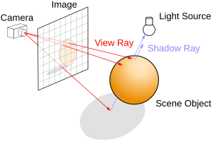

# Cinematic Path Tracer

A production-quality GPU path tracer featuring physically-based rendering, progressive accumulation, and real-time camera controls. Inspired by Pixar's RenderMan and modern PBR techniques.



## Features

### Rendering
- **Progressive Path Tracing** - Converges to ground truth over time
- **PBR Material System** - Disney-inspired BRDF with metallic/roughness workflow
- **GGX Microfacet Model** - Industry-standard specular distribution
- **Multiple Importance Sampling** - Efficient sampling for complex lighting
- **Russian Roulette** - Unbiased path termination
- **Depth of Field** - Cinematic bokeh with controllable aperture
- **Environment Lighting** - HDR procedural sky with sun

### Materials
- Diffuse (Lambertian)
- Metallic (Gold, Chrome, Bronze)
- Dielectric (Glass with refraction)
- Emissive (Area lights)

### Post-Processing
- **ACES Filmic Tonemapping** - Industry-standard color grading
- **Reinhard / Uncharted 2** - Alternative tonemappers
- **Gamma Correction** - sRGB output
- **Vignette** - Subtle cinematic effect
- **Firefly Clamping** - Reduces noise spikes

## Quick Start

```bash
make        # Build the project
make run    # Build and run
make clean  # Clean build files
```

## Controls

| Key | Action |
|-----|--------|
| **Right Mouse + WASD** | Move camera |
| **Q / E** | Move up / down |
| **Shift** | Move faster |
| **R** | Reload shaders (hot reload) |
| **T** | Cycle tonemapper |
| **+ / -** | Adjust exposure |
| **↑ / ↓** | Adjust max bounces |
| **F** | Toggle depth of field |
| **ESC** | Quit |

## Architecture

```
┌─────────────────────────────────────────────────────────────┐
│                     Path Tracing Pipeline                    │
├─────────────────────────────────────────────────────────────┤
│                                                             │
│  ┌───────────┐    ┌──────────────┐    ┌──────────────┐     │
│  │  Pass 1   │    │    Pass 2    │    │    Pass 3    │     │
│  │ PathTrace │───▶│  Accumulate  │───▶│   Display    │     │
│  │  (sample) │    │ (avg frames) │    │ (tonemap)    │     │
│  └───────────┘    └──────────────┘    └──────────────┘     │
│       │                  │                   │              │
│       ▼                  ▼                   ▼              │
│  ┌─────────┐        ┌─────────┐        ┌─────────┐         │
│  │ FBO[w]  │        │ FBO[r]  │        │ Screen  │         │
│  └─────────┘        └─────────┘        └─────────┘         │
│                                                             │
└─────────────────────────────────────────────────────────────┘
```

## Shaders

| Shader | Purpose |
|--------|---------|
| `PathTrace.glsl` | Monte Carlo path tracing with PBR BRDF |
| `Accumulate.glsl` | Progressive frame averaging |
| `Display.glsl` | Tonemapping and color grading |
| `Vertex.glsl` | Fullscreen triangle (no vertex buffer) |

## Documentation

| Document                                                              | Description                                                 |
|-----------------------------------------------------------------------|-------------------------------------------------------------|
| [Project Overview](docs/00-PROJECT-OVERVIEW.md)                       | High-level overview and technology stack                    |
| [Build Instructions](docs/01-BUILD-INSTRUCTIONS.md)                   | Complete build instructions for all platforms               |
| [OpenGL Compatibility](docs/02-OPENGL-COMPATIBILITY.md)               | OpenGL version requirements and platform limitations        |
| [Issues and Fixes](docs/03-ISSUES-AND-FIXES.md)                       | Known issues and their solutions                            |
| [Development Session](docs/04-DEVELOPMENT-SESSION.md)                 | Development history and lessons learned                     |
| [File Structure](docs/05-FILE-STRUCTURE.md)                           | Project file structure documentation                        |
| [Shaders Reference](docs/SHADERS-REFERENCE.md)                        | In-depth explanation of shader code and algorithms          |
| [**Path Tracing Algorithm**](docs/06-PATHTRACING-ALGORITHM.md)        | Comprehensive guide to the GPU path tracing implementation  |
| [**Accumulation Bug Analysis**](docs/07-ACCUMULATION-BUG-ANALYSIS.md) | Detailed analysis of the ping-pong buffer bug and fix       |
| [Quadrics User Guide](docs/USER_GUIDE_QUADRICS.md)                    | Instructions for using quadric surfaces (if applicable)     |
| [Quadrics Theory](docs/QUADRICS.md)                                   | Mathematical background on quadric surfaces (if applicable) |
| [Scene Loading](docs/OBJ_SCENE_LOADING.md)                            | Details on OBJ scene representation and loading process     |

## Building

### Prerequisites
- CMake 3.28 or higher
- C++20 compatible compiler (GCC, Clang, or MSVC)
- OpenGL 4.1+ capable GPU

### Build Instructions

#### On macOS/Linux:
```bash
make
```

Or manually:
```bash
mkdir build
cd build
cmake ..
make -j$(nproc)
```

The executable will be located at `build/App/App`

#### On Windows (Visual Studio):
```bash
mkdir build
cd build
cmake ..
cmake --build . --config Release
```

The executable will be located at `build/App/Release/App.exe`

**Note:** Dependencies (GLFW, GLAD, GLM) are automatically downloaded during the CMake configuration step.

## Technical Details

### Monte Carlo Integration
The renderer uses cosine-weighted hemisphere sampling for diffuse surfaces (optimal for Lambertian BRDF) and GGX importance sampling for specular reflections, following the math implemented in `Source/Math/MonteCarlo.cpp`.

### BRDF Model
Implements the Cook-Torrance microfacet model with:
- **D**: GGX/Trowbridge-Reitz normal distribution
- **F**: Schlick's Fresnel approximation
- **G**: Smith's geometry function with Schlick-GGX

### Accumulation
Uses ping-pong framebuffers for progressive rendering:
```
result[n] = (result[n-1] * (n-1) + sample[n]) / n
```

## Third-Party Dependencies
- [GLFW 3.4](https://github.com/glfw/glfw) - Window management
- [GLAD](https://github.com/Dav1dde/glad) - OpenGL loader
- [GLM](https://github.com/g-truc/glm) - Mathematics library

## References
- *Physically Based Rendering: From Theory to Implementation* (Pharr, Jakob, Humphreys)
- *Real-Time Rendering* (Akenine-Möller, Haines, Hoffman)
- Disney BRDF Explorer
- Pixar RenderMan documentation
